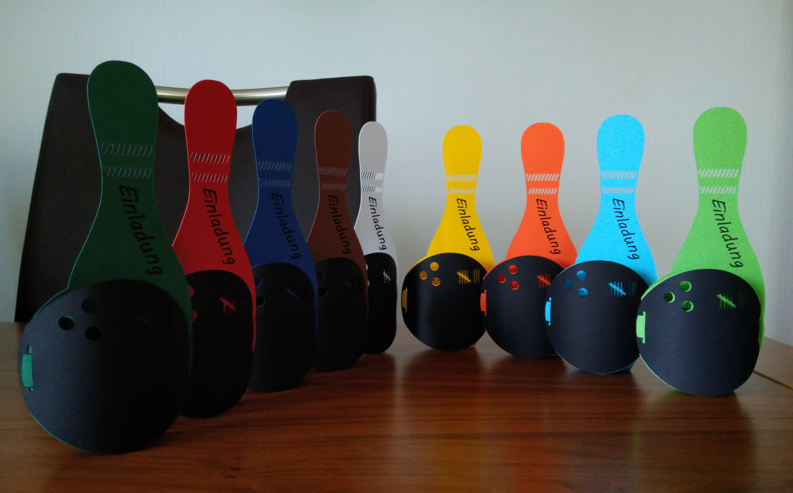
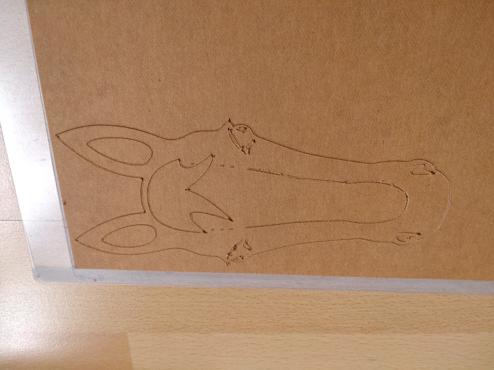
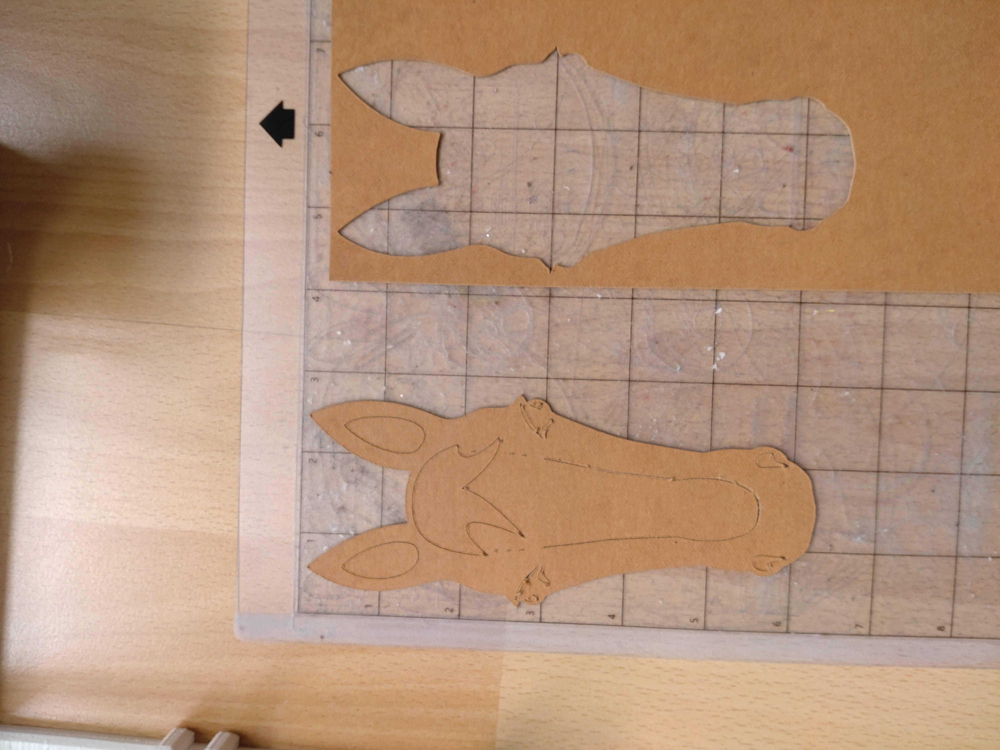
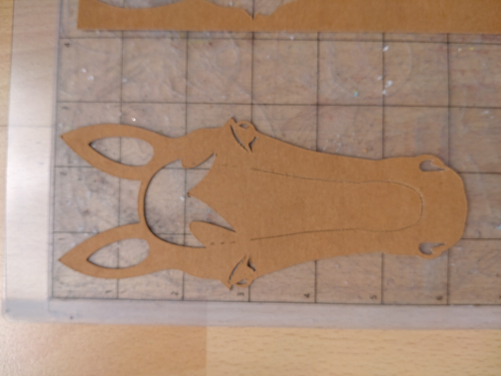
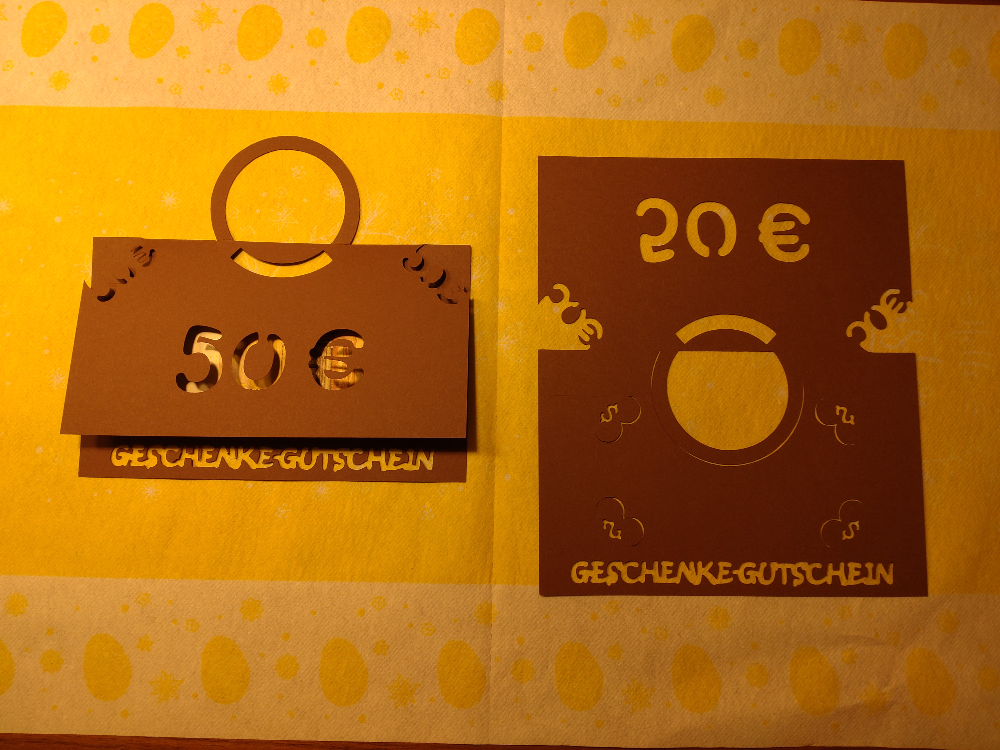
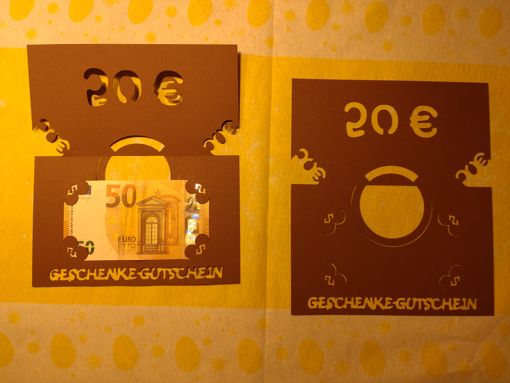

# Design-Art-Works
Some design work i made. Some SVG with graphics and plotter files.

I got two 3D printers (FDM and MSLA). Recently i added a Silhouette Cameo 4 cut plotter to my tool park.

I use Inkscape to create SVG files and also (thanks to fablabnbg/inkscape-silhouette) use the Cameo 4 for cutting from Inkscape.

Sometimes i use additional Rhino 7 for unfolding curved surfaces or something.

I add some example files here. Some may find it usefull:

## Birthday invitation Card for Bowling event

 

## Birthday present, Horse-Head-Bookmark

 
 
 
 
 

## Money present, Bag style Card

 
 
 
 

